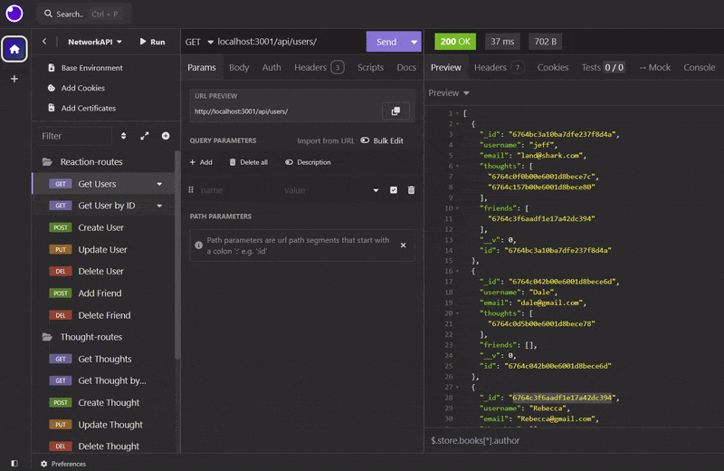
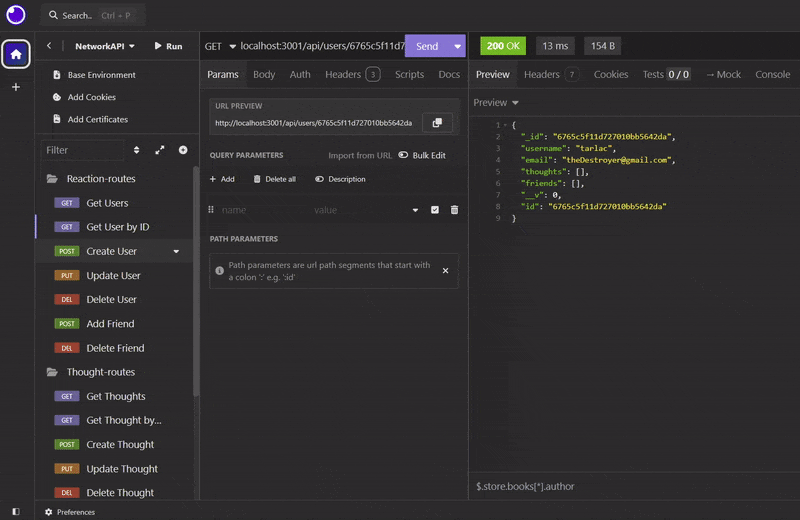
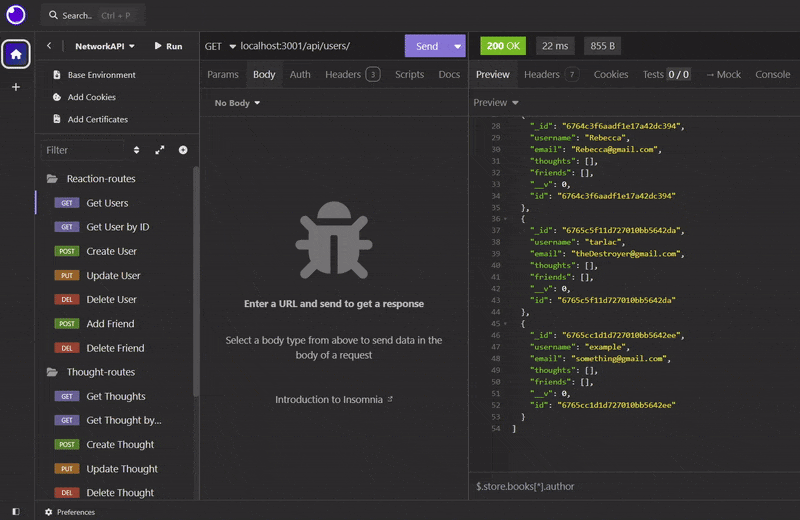
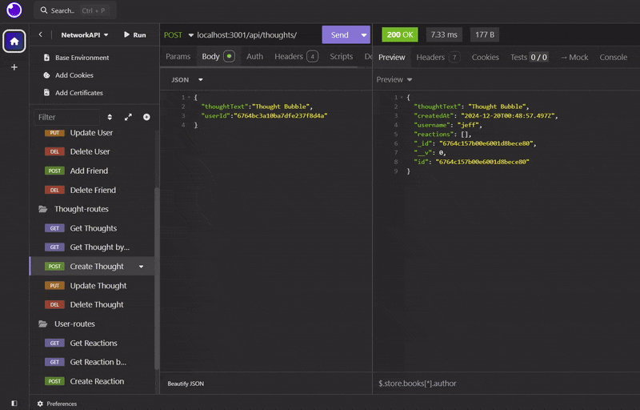
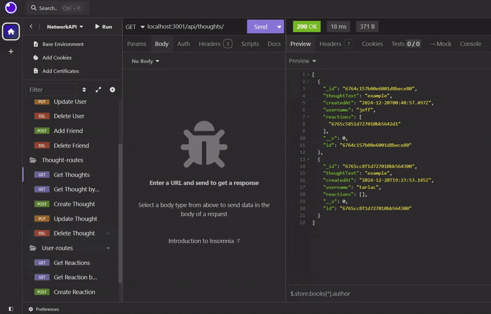
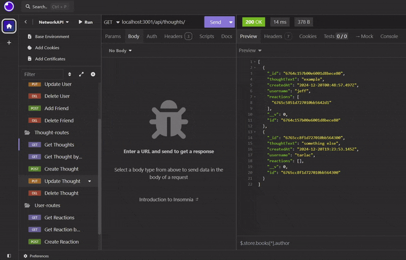
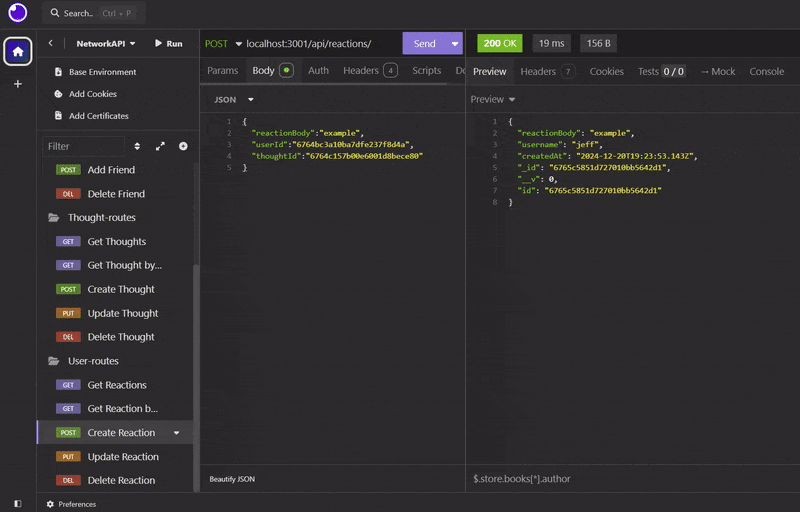
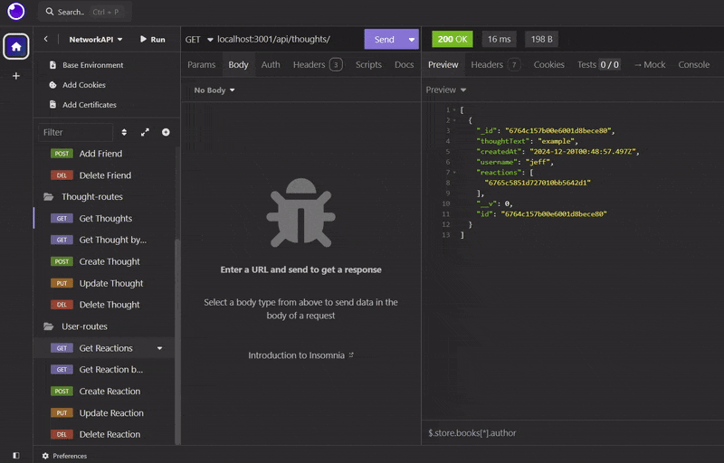
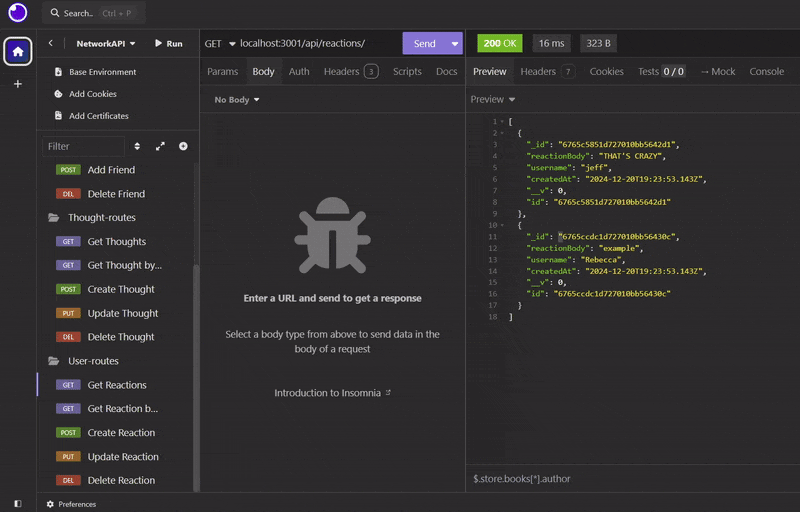
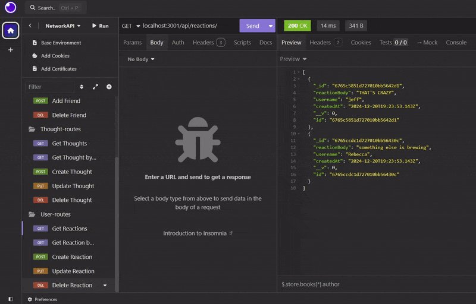

# Network API


## Description

Description

## 📁 Table of Contents

- [Installation](#installation)
- [Usage](#usage)
- [Contributing](#contributing)

## Installation

Notes:

- This program runs on port 3001 by default. Ensure that this port is open, or add a .env file to specify the PORT variable.
- This program requires Node and MongoDB to be installed on your machine.

Resources:

- [Node Installation](https://nodejs.org/en/download/package-manager)
- [MongoDB Installation](https://coding-boot-camp.github.io/full-stack/mongodb/how-to-install-mongodb)

```shell
# Step 1: clone this repository
git clone https://github.com/Dan-Swarts/NetworkAPI.git

# Step 2: install dependencies:
npm i

# Step 3: run the program:
npm run start

```

## Usage

Open your API testing tool, such as Postman or Insomnia, and utilize the following routes. If you changed the active port using a .env file, make sure to change it from 3001. For all posts, include a JSON body matching the schema deonstrated.

- Get Users



<br>
<br>
<br>

- Create Users



<br>
<br>
<br>

- Delete User



<br>
<br>
<br>

- Create Thought



<br>
<br>
<br>

- Update Thought



<br>
<br>
<br>

- Delete Thought



<br>
<br>
<br>

- Create Reaction



<br>
<br>
<br>

- Get Reaction



<br>
<br>
<br>

- Update Reaction



<br>
<br>
<br>

- Delete Reaction



## Routes:

User routes:

```shell
# Get all Users
GET localhost:3001/api/users/

# Get specific User
GET localhost:3001/api/users/{userID}

# Create User
POST localhost:3001/api/users/
{
	"username":"example",
	"email":"example@example.com"
}

# Update User
PUT localhost:3001/api/users/{userID}
{
	"username":"example",
	"email":"example@example.com"
}

# Delete User
DELETE localhost:3001/api/users/{userID}

# Add a friend
POST localhost:3001/api/users/friends/{userID}
{
	"friendUsername":"example"
}

# Remove a friend
DELETE localhost:3001/api/users/friends/{userID}
{
	"friendUsername":"example"
}
```

Thought routes:

```shell
# Get all Thoughts
GET localhost:3001/api/thoughts/

# Get specific Thought
GET localhost:3001/api/thoughts/{thoughtID}

# Create Thought
POST localhost:3001/api/thoughts/
{
	"thoughtText":"example",
	"userId":"6757e3ddf36c8d98521ba307"
}

# Update Thought
PUT localhost:3001/api/thoughts/{thoughtID}
{
	"thoughtText":"example"
}

# Delete Thought
DELETE localhost:3001/api/thoughts/{thoughtID}
```

Reaction routes:

```shell
# Get all Reactions
GET localhost:3001/api/reactions/

# Get specific Reaction
GET localhost:3001/api/reactions/{reactionID}

# Create Reaction
POST localhost:3001/api/reactions/
{
	"reactionBody":"example",
	"userId":"6757e3ddf36c8d98521ba307",
	"thoughtId":"6757f654b0fea0803fd5ccbc"
}

# Update Reaction
PUT localhost:3001/api/reactions/{reactionID}
{
	"reactionBody":"example"
}

# Delete Reaction
DELETE localhost:3001/api/reactions/{reactionID}
```

## Contributing

> [!IMPORTANT]
> Whether you have feedback on features, have encountered any bugs, or have suggestions for enhancements, we're eager to hear from you. Your insights help us make the Network API library more robust and user-friendly.

Please feel free to contribute by [submitting an issue](https://github.com/Dan-Swarts/NetworkAPI) or [joining the discussions](https://github.com/Dan-Swarts/NetworkAPI). Each contribution helps us grow and improve.

We appreciate your support and look forward to making our product even better with your help!

If you created an application or package and would like other developers to contribute it, you can include guidelines for how to do so. The [Contributor Covenant](https://www.contributor-covenant.org/) is an industry standard, but you can always write your own if you'd prefer.
